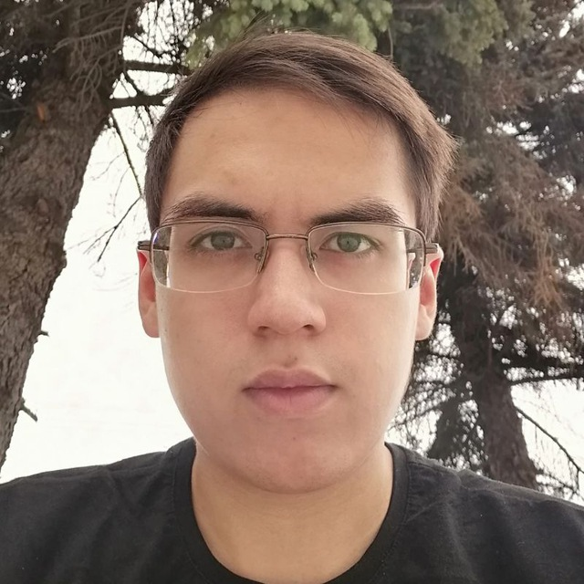

# Aleksandr Ivanov




### My projects
- [My CV](https://github.com/qiloz/rsschool-cv/tree/rsschool-cv-html)

### Contacts
* Telegram: @c_pag
* Discord: (rs-school) MrSandwich(@qiloz)
* Github: @qiloz

### About me
- my goal: improve myself;
- my forte: involvement in the process;
- I very like to find something new in development. If i sit for very interesting project, i will working for it for a long time
  
### Skills
- Basic skills for Linux-CLI
- To improve myself i learning: C++, Java, Python
- IDE: IntelliJ IDEA/PyCharm
- Text editor: Vim
- Education level: secondary specialized in system administration, in the process of obtaining higher education
### Example for my code
(from Codewars)
```c++
int multiply(int a, int b)
{
    return a * b;
}
```

### Language
Russian - Native
B2 - [Link to my certificate](https://www.efset.org/cert/zQMXp6)
